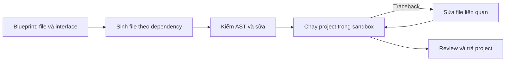

# Research: các hệ thống auto research tạo và chạy code như thế nào?

Ngày khảo sát: **2026-10-07**. Trọng tâm: lỗi format, dữ liệu, đường dẫn, môi trường và
vòng sửa lỗi; liên hệ với contract notebook của MVP0.

Đã đọc README và source tại các revision dưới đây. Đây là khảo sát source, chưa chạy
thí nghiệm để đo độ tin cậy hoặc chi phí của các hệ thống.

| Hệ thống | Revision khảo sát |
|---|---|
| [AutoResearchClaw](https://github.com/aiming-lab/AutoResearchClaw) | `be4ba4755bf1b52220f25e13b2293b5956590070` |
| [karpathy/autoresearch](https://github.com/karpathy/autoresearch) | `228791fb499afffb54b46200aca536f79142f117` |
| [AIDE](https://github.com/WecoAI/aideml) | `60b3978ddf65b71f86eb7c64506965048a1398cf` |
| [AI Scientist v1](https://github.com/SakanaAI/AI-Scientist) | `1de1dbc1f4ee2c5f61e9c94348d55eb51d7fa2eb` |
| AI Scientist v2 và workbench hiện tại | Checkout local tại `0ae3f8056debd95620fe5d4c0b0d604dddd588ec` |

## 1. Kết luận

Trong các luồng tạo code ML đã đọc, đơn vị thực thi chủ yếu là **script hoặc project
Python**. Có hai cách chính: sửa một baseline có sẵn, hoặc sinh code rồi chạy và sửa theo
phản hồi. AutoResearchClaw kết hợp việc sinh project với hạ tầng thực thi cố định.

**Đề xuất cho MVP0:** app tạo notebook và quản lý runtime; agent viết workload qua một
API nhỏ. Cung cấp template cho tác vụ quen thuộc, đồng thời giữ đường viết Python tự do
cho nhu cầu mới. Khâu xác minh dữ liệu và chạy thử cần tách khỏi kiểm cú pháp.

Đây là đề xuất rút ra từ khảo sát, chưa phải thay đổi đã triển khai.

## 2. AutoResearchClaw

### 2.1. Pipeline và đơn vị code

Repo có pipeline 23 stage. Phần liên quan gồm thiết kế thí nghiệm (9), sinh code (10),
chạy (12), refine (13), phân tích (14), rồi quyết định tiếp tục/refine/pivot (15).
Các template hội nghị được README giới thiệu là **template LaTeX cho paper**.
[README](https://github.com/aiming-lab/AutoResearchClaw#-pipeline-23-stages-8-phases)

Stage 10 sinh project nhiều file, có `main.py` làm entrypoint, cùng tài liệu spec.
Benchmark plan từ stage 9 được đưa vào hướng dẫn sinh code.
[Source stage 10](https://github.com/aiming-lab/AutoResearchClaw/blob/be4ba4755bf1b52220f25e13b2293b5956590070/researchclaw/pipeline/stage_impls/_code_generation.py#L356)

Nhánh CodeAgent có luồng:

Các file đã sinh được tóm tắt bằng AST để cung cấp context cho file phụ thuộc.
CodeAgent chỉ có bước chạy thử khi được cấp sandbox factory.
[CodeAgent](https://github.com/aiming-lab/AutoResearchClaw/blob/be4ba4755bf1b52220f25e13b2293b5956590070/researchclaw/pipeline/code_agent.py#L192)

Cấu hình mặc định bật blueprint, sinh tuần tự và kiểm AST; exec-fix tối đa 3 vòng với
timeout 60 giây/lượt. Tree search mặc định tắt. Dataclass experiment mặc định là
`simulated`, còn YAML mẫu chọn `sandbox`; không thể suy ra mọi lần chạy đều dùng Docker.
[Config](https://github.com/aiming-lab/AutoResearchClaw/blob/be4ba4755bf1b52220f25e13b2293b5956590070/researchclaw/config.py#L457),
[YAML mẫu](https://github.com/aiming-lab/AutoResearchClaw/blob/be4ba4755bf1b52220f25e13b2293b5956590070/config.researchclaw.example.yaml#L98)

### 2.2. Harness cố định làm gì?

`ExperimentHarness` cung cấp timer, `should_stop()`, kiểm NaN/Inf, ghi metric ra stdout
và xuất `results.json`. Nó **không chứa sẵn dataloader, model, training loop hoặc phép
đánh giá**. Một số hợp lệ do workload gửi vào chưa chứng minh metric được tính đúng.
`should_stop()` cần workload gọi; timeout cưỡng chế nằm ở lớp thực thi.
[Harness](https://github.com/aiming-lab/AutoResearchClaw/blob/be4ba4755bf1b52220f25e13b2293b5956590070/researchclaw/experiment/harness_template.py#L20)

Sandbox chèn file `experiment_harness.py`, bỏ qua file cùng tên từ project, kiểm entrypoint
và chạy subprocess có timeout. Trong đường chạy đã đọc, chưa thấy quyền file chỉ đọc hoặc
kiểm hash chống workload sửa harness khi đang chạy. Chế độ subprocess cũng không tương
đương cách ly bằng container.
[Sandbox](https://github.com/aiming-lab/AutoResearchClaw/blob/be4ba4755bf1b52220f25e13b2293b5956590070/researchclaw/experiment/sandbox.py#L353)

### 2.3. Dữ liệu và dependency

BenchmarkAgent có các bước survey → select → acquire → validate. Kết quả chứa lựa chọn
dataset/baseline, code loader, setup và requirements.
[Benchmark orchestrator](https://github.com/aiming-lab/AutoResearchClaw/blob/be4ba4755bf1b52220f25e13b2293b5956590070/researchclaw/agents/benchmark_agent/orchestrator.py#L58)

Loader vẫn được LLM sinh; hướng dẫn yêu cầu dùng `data_root`, tách train/val/test và
download theo loại dataset. Validator kiểm AST, import được khai báo và nhờ LLM review.
Hàm validator này không tải dữ liệu rồi đọc một batch để xác minh loader.
[Acquirer](https://github.com/aiming-lab/AutoResearchClaw/blob/be4ba4755bf1b52220f25e13b2293b5956590070/researchclaw/agents/benchmark_agent/acquirer.py#L24),
[Validator](https://github.com/aiming-lab/AutoResearchClaw/blob/be4ba4755bf1b52220f25e13b2293b5956590070/researchclaw/agents/benchmark_agent/validator.py#L141)

DockerSandbox chuẩn bị requirements/setup trước khi chạy và mount cache dataset vào
`/workspace/data`. Chế độ mạng có thể cấu hình. Đây là môi trường Docker riêng;
đường dẫn và package của nó cần được ánh xạ khi chuyển sang Kaggle.
[Docker sandbox](https://github.com/aiming-lab/AutoResearchClaw/blob/be4ba4755bf1b52220f25e13b2293b5956590070/researchclaw/experiment/docker_sandbox.py#L364)

### 2.4. Contract và kiểm kết quả

`StageContract` khai báo file đầu vào/đầu ra, tiêu chí hoàn thành và retry cho từng stage.
Đây là contract giữa các bước pipeline; bản khai báo không tự kiểm schema CSV hay sự
tồn tại của mount Kaggle.
[Stage contracts](https://github.com/aiming-lab/AutoResearchClaw/blob/be4ba4755bf1b52220f25e13b2293b5956590070/researchclaw/pipeline/contracts.py#L17)

Stage 12 thu kết quả thực thi, parse metric và chặn một số trường hợp crash hoặc kết thúc
quá nhanh mà không có metric. Các điều kiện này là kiểm tín hiệu và số hữu hạn, chưa đủ
để xác minh tính đúng khoa học của phép đo.
[Execution](https://github.com/aiming-lab/AutoResearchClaw/blob/be4ba4755bf1b52220f25e13b2293b5956590070/researchclaw/pipeline/stage_impls/_execution.py#L498)

Sau stage 14, runner có thể gọi diagnosis/repair nếu được bật và cần sửa; đường này loại
trừ một số sandbox agent chuyên ngành.
[Runner](https://github.com/aiming-lab/AutoResearchClaw/blob/be4ba4755bf1b52220f25e13b2293b5956590070/researchclaw/pipeline/runner.py#L669)

### 2.5. Giới hạn quan sát được

- CodeAgent có thể trả code khi hết vòng sửa; bản sửa cuối của exec-fix có thể chưa chạy
  lại. Stage 10 chặn lỗi syntax/import nghiêm trọng. Code được trả về chưa bảo đảm chạy
  thành công.
  [CodeAgent](https://github.com/aiming-lab/AutoResearchClaw/blob/be4ba4755bf1b52220f25e13b2293b5956590070/researchclaw/pipeline/code_agent.py#L663),
  [Gate stage 10](https://github.com/aiming-lab/AutoResearchClaw/blob/be4ba4755bf1b52220f25e13b2293b5956590070/researchclaw/pipeline/stage_impls/_code_generation.py#L869)
- Lượt thử 60 giây chạy project; chưa thấy chế độ riêng chỉ kiểm một batch ở đường gọi này.
  [Đường gọi sandbox](https://github.com/aiming-lab/AutoResearchClaw/blob/be4ba4755bf1b52220f25e13b2293b5956590070/researchclaw/pipeline/code_agent.py#L1407)
- Schema dùng thuật ngữ tổng quát như condition/reference/proposed, nhưng vẫn có
  primary metric, nhiều seed và mặc định biểu đồ. Vì thế cần thiết kế contract riêng cho
  các tác vụ như xuất ảnh, EDA hoặc tạo dữ liệu.
  [Experiment schema](https://github.com/aiming-lab/AutoResearchClaw/blob/be4ba4755bf1b52220f25e13b2293b5956590070/researchclaw/domains/experiment_schema.py#L17)

Các nhận xét trên là đọc đường code cụ thể, chưa phải kết luận rằng mọi backend của repo
có cùng hành vi hoặc đã tái hiện lỗi trong thực nghiệm.

## 3. Đối chiếu với các hệ thống khác

| Hệ thống | Agent được viết gì? | Hệ thống giữ phần gì? | Cách phản hồi lỗi |
|---|---|---|---|
| AutoResearchClaw | Project Python nhiều file | Stage artifacts, harness, executor | Kiểm AST, chạy project, sửa theo traceback, refine |
| karpathy/autoresearch | Sửa `train.py` có sẵn | `prepare.py`: dữ liệu, tokenizer, evaluation | Chạy thật; xem log crash; giữ/bỏ thay đổi qua Git |
| AI Scientist v1 | Sửa `experiment.py` trong template theo đề tài | Baseline, lệnh chạy, format kết quả | Subprocess; đưa stderr/timeout lại cho coder |
| AIDE | Sinh script hoàn chỉnh | Workspace input/working, interpreter, journal | Node lỗi được debug từ code và output |
| AI Scientist v2 | Sinh/sửa script trong cây tìm kiếm | Workspace, interpreter, journal, lịch tìm kiếm | Chạy script; debug node lỗi; cải tiến node chạy được |

### karpathy/autoresearch

`program.md` yêu cầu chỉ sửa `train.py`, giữ nguyên `prepare.py` và dependency. Repo có
baseline để chạy trước; vòng nghiên cứu ghi kết quả và dùng Git giữ/bỏ thay đổi.
Đây là chính sách dành cho agent; chưa thể xem nó như quyền file được hệ điều hành khóa.
[Hướng dẫn agent](https://github.com/karpathy/autoresearch/blob/228791fb499afffb54b46200aca536f79142f117/program.md#L21)

`prepare.py` thực sự chứa dataloader và hàm `evaluate_bpb`; `train.py` gọi chúng, thực hiện
training rồi in summary. Ngân sách 300 giây là thời gian training, loại warmup/compilation;
không phải timeout 300 giây cho toàn process.
[Data và evaluation](https://github.com/karpathy/autoresearch/blob/228791fb499afffb54b46200aca536f79142f117/prepare.py#L276),
[Training](https://github.com/karpathy/autoresearch/blob/228791fb499afffb54b46200aca536f79142f117/train.py#L579)

**Bài học:** giữ cố định dữ liệu và evaluation khi muốn so sánh các thay đổi model.
Phạm vi của repo này hẹp hơn nhu cầu general implement của workbench.

### AI Scientist v1

Có template experiment theo đề tài. Runner dùng lệnh cố định
`python experiment.py --out_dir=run_i`, lưu snapshot source, đọc `final_info.json` khi
thành công và đưa stderr cho coder khi lỗi. Source có `MAX_ITERS=4`, `MAX_RUNS=5`.
[Runner](https://github.com/SakanaAI/AI-Scientist/blob/1de1dbc1f4ee2c5f61e9c94348d55eb51d7fa2eb/ai_scientist/perform_experiments.py#L29),
[Ví dụ template](https://github.com/SakanaAI/AI-Scientist/blob/1de1dbc1f4ee2c5f61e9c94348d55eb51d7fa2eb/templates/2d_diffusion/experiment.py)

**Bài học:** code mẫu có sẵn giúp agent có điểm xuất phát cụ thể; agent vẫn sửa Python,
không chỉ điền vài trường cấu hình.

### AIDE

App chuẩn bị `input` và `working`, có thể đưa data preview vào prompt. Agent sinh script;
`step()` chạy code và chọn draft/debug/improve dựa trên node trước. Prompt debug chứa
source và execution output. Metric được LLM trích từ log; exception hoặc thiếu metric
khiến node bị đánh dấu lỗi.
[Agent](https://github.com/WecoAI/aideml/blob/60b3978ddf65b71f86eb7c64506965048a1398cf/aide/agent.py#L344),
[Workspace](https://github.com/WecoAI/aideml/blob/60b3978ddf65b71f86eb7c64506965048a1398cf/aide/utils/config.py#L177)

**Bài học:** file/schema preview và phản hồi từ lần chạy trước rất hữu ích; nên xuất kết
quả bằng schema có cấu trúc để bớt phụ thuộc vào LLM đọc log.

### AI Scientist v2 trong checkout

README mô tả v2 bỏ sự phụ thuộc vào template do con người viết để mở rộng phạm vi.
[README](https://github.com/SakanaAI/AI-Scientist-v2)

Source local sinh script bằng `_draft`, tách/format code, thực thi qua Interpreter và dùng
`_debug` với source cùng terminal output khi node lỗi. Chi tiết đã ghi trong
[research trước](D:/Documents/AI-Scientist-v2/docs/customization/TRAINING_FRAMEWORK_RESEARCH.md).
Các điểm đọc chính: [draft/debug](D:/Documents/AI-Scientist-v2/ai_scientist/treesearch/parallel_agent.py:453),
[interpreter](D:/Documents/AI-Scientist-v2/ai_scientist/treesearch/interpreter.py:213).

**Bài học:** độ linh hoạt đến từ việc cho viết và thực thi Python. Contract notebook cho
Kaggle là phần tích hợp riêng của workbench.

## 4. Đề xuất cụ thể cho contract của MVP0

Phần này là thiết kế đề xuất cho nhu cầu của user, không phải API có sẵn của các repo.

### 4.1. Ba lớp trách nhiệm

| Lớp | Trách nhiệm |
|---|---|
| Runtime chung do app quản lý | Tạo notebook; context có version; resolve input; output root; log/event; timeout; trạng thái lỗi |
| Adapter/template theo tác vụ | Schema dữ liệu; loader đã biết; phép đánh giá; smoke check; output bắt buộc của tác vụ |
| Workload do agent viết | Logic mới, model, biến đổi dữ liệu hoặc phương pháp phân tích; config và tài liệu |

Training adapter có thể quản lý split, loop, evaluator và checkpoint. Adapter EDA hoặc
tạo synthetic data có bộ output riêng. Runtime chung chỉ yêu cầu output đã được khai báo
trong proposal; biểu đồ và loss curve là tùy tác vụ.

Giữ template của tác vụ đang hỗ trợ để có điểm bắt đầu chạy được. Khi template chưa đáp
ứng một ý tưởng, cho agent viết thêm module qua cùng API runtime.

### 4.2. Dữ liệu được xác minh thay cho đường dẫn agent đoán

Chuẩn bị manifest gồm nguồn, tên file, cột, kiểu dữ liệu, khóa ghép và các alias logic.
Agent dùng alias như `labels` hoặc `images`; runtime ánh xạ alias sang file thực tế.

Ở Kaggle, startup phải kiểm mount và file trên filesystem đang chạy, đọc schema/sample
và báo lỗi rõ nếu không khớp. Metadata nhìn từ máy local chưa chứng minh mount runtime.
Với Soil, nên giữ adapter đã xác minh cách ghép label/ảnh và split theo sample.

### 4.3. Các bước kiểm có kết quả riêng

1. **Đóng gói:** kiểm syntax, entrypoint, config và notebook schema.
2. **Môi trường/dữ liệu:** kiểm dependency, mount, file, schema và một sample.
3. **Chạy thử nhỏ:** chế độ smoke được định nghĩa rõ; training chạy một batch, EDA đọc
   sample và ghi một output. Bản source sửa phải được chạy thử lại trước khi nhận trạng thái đạt.
4. **Chạy workload:** dùng đúng source/config/data đã gắn với lượt user yêu cầu.
5. **Thu kết quả:** kiểm output manifest và các yêu cầu của adapter.

Có thể kiểm bước 2–3 local nếu có snapshot dữ liệu đại diện. Nếu chỉ có dữ liệu trong
Kaggle, đặt chúng ở đầu cùng notebook; điều đó giúp dừng sớm và chẩn đoán rõ, vẫn cần một
lượt thực thi Kaggle để biết kết quả. Không được hiển thị kiểm static thành kiểm runtime.

### 4.4. Sửa lỗi và quyền quyết định của user

Ghi feedback có cấu trúc: phase lỗi, loại lỗi, file/dòng, traceback, môi trường và input
đã resolve. Coder nhận đúng context đó ở lượt sửa tiếp theo. Giữ source/hash và log của
từng lượt để biết bản nào thực sự chạy được.

Theo lựa chọn đã xác nhận: **user quyết định từng lượt code/chạy, không giới hạn tổng số
lượt**. Các giới hạn vòng sửa tự động của repo nghiên cứu không cần trở thành quota của
user. Mỗi thao tác gửi vẫn cần idempotency và quản lý phiên đang chạy.

### 4.5. Thứ tự triển khai đề xuất

1. Hoàn thiện resolver/manifest và adapter cho tác vụ Soil hiện có; tái sử dụng workload
   đã chạy thành công làm baseline.
2. Thêm smoke mode và feedback theo phase; GUI phân biệt kiểm đóng gói với kiểm runtime.
3. Cung cấp template training tái sử dụng; cho agent chỉnh phần model/method/config.
4. Mở rộng adapter cho các purpose khác qua cùng runtime.

Ưu tiên này trực tiếp xử lý lỗi từng gặp: notebook format thuộc phần đóng gói, mount/file
thuộc resolver, tensor/loader thuộc smoke, còn lỗi logic thí nghiệm thuộc workload/evaluator.
Việc áp dụng nguyên pipeline viết paper của AutoResearchClaw sẽ thêm nhiều trách nhiệm
chưa cần thiết cho MVP0.
