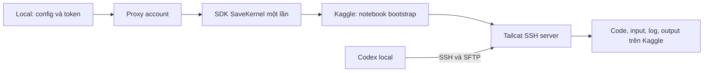

# Thử nghiệm Kaggle qua Tailcat + SSH

Ngày: **2026-10-07**. User chọn **Codex local, thao tác trong Kaggle qua SSH**.
Mục tiêu: kiểm vòng sửa/chạy code, đọc dữ liệu/log, lấy output và dừng qua SSH.

## 1. Kết quả

**Khả thi trong lượt CPU đã thử.** Đã push một notebook bootstrap bằng SDK/token qua
proxy, sau đó dùng SSH/SFTP để làm việc trong cùng môi trường Kaggle.

| Thông tin | Giá trị |
|---|---|
| Account | `huynhtrungcuong` / alias `jhin_access_token.txt` |
| Notebook | [Tailcat SSH CPU probe](https://www.kaggle.com/code/huynhtrungcuong/tailcat-ssh-cpu-probe-c818c3fb260a) |
| Version / kernel | `1` / `137424922` |
| Script version / session | `217216860` / `355939156` |
| Trạng thái cuối | `COMPLETE`, xác minh qua MCP lúc `03:51:41 UTC` |
| Account sau khi dừng | `0` active session, xác minh lúc `03:48:06 UTC` |
| Compute | CPU; GPU và TPU tắt |
| Tailcat / SDK | `v0.7.0` / `kagglesdk==0.1.37` |

### Những thao tác đã làm thật

| Kiểm tra | Bằng chứng |
|---|---|
| Kết nối SSH | Remote trả `Linux`, UID `0`; kết nối đầu khoảng `5.83 s`. |
| Xác thực SSH | Client không có SSH key bị từ chối bằng `Permission denied (publickey)`. |
| Mount dữ liệu | Đọc được `/kaggle/input/competitions/soil-grain-size-from-photos`. |
| Schema thật | Tìm được `Training_labels_updated.csv`, đọc header và đếm `24` dòng. |
| Upload/chạy code | Python được gửi bằng SFTP, thực thi trên Kaggle; hash source remote khớp local. |
| Lấy artifact | Tải `result.json`, `probe.log`, `synthetic.csv` bằng SFTP. |
| Sửa và chạy lại | Đổi script từ tạo `50` sang `75` dòng, chạy lại và tải file; không submit notebook mới. |
| Log trực tiếp | Đọc log tick của workload đang chạy bằng SSH. |
| Dừng workload | Gửi SIGTERM tới PID đã kiểm đúng command; `/proc` xác nhận process không còn. |
| Terminal liên tục | Mở Bash qua PTY, chạy lệnh đọc CSV/log; terminal xác nhận `75` dòng output. |
| Kết thúc notebook | Marker STOP được gửi qua SSH; bootstrap thoát, Kaggle xác nhận `COMPLETE`. |
| Chống gửi trùng | Intent cũ chặn lệnh push trước khi truy cập SDK. |

Không gọi Codex con. Chính agent trong phiên này tạo/sửa source và thao tác môi trường
remote. Chưa chạy training GPU hoặc đo tải checkpoint lớn.

## 2. Luồng thử nghiệm

Endpoint Tailcat và server key được tạo trước ở local với relay cố định. Notebook nhận
server key cùng SSH public key; client biết endpoint trước khi notebook chạy. Không cần
đọc log Kaggle để khám phá endpoint. SSH private key và Kaggle token ở local.

Tailcat có SSH server trong userspace, hỗ trợ public key và SFTP; không cần account
Tailscale hoặc dịch vụ `sshd` riêng. Kết nối có thể đi direct hoặc qua DERP.
[Tài liệu Tailcat](https://github.com/tailscale/tailcat)

Notebook bootstrap có TTL; workload riêng chạy qua terminal. Trong lần này, các thao tác
code/log/artifact/stop sau khi kết nối dùng SSH/SFTP. MCP cũ được dùng để kiểm account
rảnh trước thử và xác minh trạng thái cuối; chưa thay control plane của GUI.

## 3. Vấn đề gặp và xử lý

### SDK trả slug khác tên yêu cầu

SaveKernel tạo slug từ title của notebook mới trong lần thử. URL trả về là nguồn để
xác định notebook thật. Prototype đã dùng title khớp slug dự kiến và chuẩn hóa identity
theo URL response, kiểm owner; không push lại lượt đã chạy.

### SSH key trên Windows

OpenSSH cần quyền file phù hợp. Đã đặt ACL riêng cho private key; generator cuối tự
thực hiện bước này. Khóa SSH và tunnel sinh riêng cho mỗi lượt, nằm trong thư mục ignored.

### Đường truyền qua relay

Trong cửa sổ kiểm 10 giây, chưa thiết lập được đường UDP direct. Ping đi qua `DERP(1)`,
RTT khoảng `288–300 ms`. Lệnh SSH mở kết nối mới mất khoảng `3.7–4.7 s` sau lần đầu.
Key của lượt này chứa relay Tokyo (`304 / tok`, `tc304a.ipn.dev`). `DERP(1)` là mã
nội bộ được gán lại khi giải mã địa chỉ có nhúng thông tin relay. Generator hiện dùng
`--region=tok` để mọi phiên mới cố định Tokyo, thay vì chọn region gần nhất lúc tạo key.
Terminal `shell` giữ kết nối đã hoạt động; các thao tác riêng trong script kiểm tra
mở SSH mới, chưa dùng một kết nối xuyên suốt cả lượt. Chưa đủ số liệu để kết luận
tốc độ tải file lớn.

### Endpoint status của SDK 0.1.37 trả 404

`GetKernelSessionStatus` qua endpoint generated trả 404. Hai cách gọi legacy đã thử cũng
trả 404 trong thử nghiệm; chưa xác định đầy đủ nguyên nhân phía Kaggle. Đã bỏ lệnh status
không hoạt động khỏi prototype. MCP cũ xác minh đúng kernel/version/session đã `COMPLETE`.

## 4. Những phần có thể rút gọn

Đề xuất cho bước tích hợp tiếp theo, dựa trên kết quả này:

- **Local control plane:** chọn account/proxy, push bootstrap, lưu identity và timeout;
  kiểm trạng thái ngoài tunnel, có cách dừng dự phòng.
- **SSH transport:** terminal, upload/download, điều khiển PID của workload.
- **Remote workspace:** context, source, environment, log và output nằm trên Kaggle.
- **Workbench:** lưu proposal/approval/journal và đưa terminal remote cho coder.

Việc sửa/chạy lại code trong session không cần SaveKernel thêm lần nữa. Workload có thể
kiểm path và schema ngay trên filesystem thật. Notebook format do bootstrap cố định quản lý.

## 5. Giới hạn phải giữ rõ

1. `stop` qua SSH ở prototype là kết thúc bootstrap bình thường; trạng thái Kaggle là
   `COMPLETE`, không phải thao tác CancelSession của control plane.
2. Khi chưa có SSH hoặc tunnel mất, cần timeout và một cách kiểm/dừng bên ngoài SSH.
3. PoC chủ động tải output trước khi dừng; chưa có cơ chế phục hồi workspace sang
   session mới.
4. Chưa xác minh GPU/quota, session dài, file lớn, reconnect sau gián đoạn mạng hoặc toàn
   bộ pipeline proposal → coder → report trong GUI.
5. Relay dùng chung có rate limit theo tài liệu Tailcat; chưa đo ảnh hưởng tới artifact lớn.
   [Relay Tailcat](https://github.com/tailscale/tailcat#tailcat)

## 6. Chạy lại

[Hướng dẫn và lệnh](D:/Documents/AI-Scientist-v2/tools/kaggle_tailcat/README.md)

Source: [controller](D:/Documents/AI-Scientist-v2/tools/kaggle_tailcat/poc.py),
[bootstrap](D:/Documents/AI-Scientist-v2/tools/kaggle_tailcat/bootstrap.py).

Bằng chứng local của lượt thực tế:
[probe](D:/Documents/AI-Scientist-v2/.workbench/tailcat-poc/c818c3fb260a4edd936c1dae783088b9/probe-evidence.json),
[sửa/chạy/log/dừng](D:/Documents/AI-Scientist-v2/.workbench/tailcat-poc/c818c3fb260a4edd936c1dae783088b9/exercise-evidence.json),
[đường truyền](D:/Documents/AI-Scientist-v2/.workbench/tailcat-poc/c818c3fb260a4edd936c1dae783088b9/network.json).

Sau khi thêm ACL tự động và chuẩn hóa identity, đã kiểm generator cuối với một bộ state
offline riêng: notebook hợp schema, source compile được; không submit lượt thứ hai.
