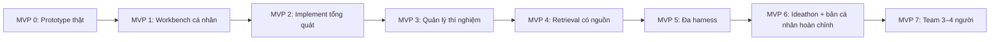

# Product Roadmap — từ prototype đến General Implementation Agent hoàn chỉnh

Ngày: **2026-10-06**, Asia/Saigon. Revision **1**.
Nền tảng: fork AI Scientist/v2 tại **96bd51617cfdbb494a9fc283af00fe090edfae48**.
Nguồn yêu cầu: [DESIGN_BRIEF.md](DESIGN_BRIEF.md).
Tài liệu này là roadmap chính, thay cách chia V0/V1/team chung chung trước đây.
[CUSTOMIZATION_PLAN.md](CUSTOMIZATION_PLAN.md) mô tả nền tảng và phần code cần custom.

## 1. Sản phẩm cuối cùng và ranh giới hoàn thành

**Bản cá nhân hoàn chỉnh:** một GUI local giúp user tạo project, quản lý Library, thảo luận idea,
duyệt proposal, để implement agent tự code/kiểm tra/sửa lỗi/chạy thí nghiệm và nhận báo cáo.
User theo dõi nhiều run, curves, ETA, lịch sử, tìm lại paper/run bằng ngôn ngữ tự nhiên,
thay harness và bật Ideathon khi muốn. Context, code và kết quả đủ để tiếp tục/tái chạy phạm vi đã hỗ trợ.

General ở đây là workflow không khóa vào một competition, một template hoặc một harness.
Nghiệm thu bằng các nhiệm vụ ML/CV/workshop/paper cụ thể; không tuyên bố agent giải đúng mọi đề bài.

**Bản team hoàn chỉnh:** 3–4 người dùng cùng project/Library và lịch sử, có attribution,
quyền truy cập và quản lý tài nguyên chung; bản cá nhân và dữ liệu cũ vẫn dùng được.

| Mốc sản phẩm | Checkpoint chốt |
| --- | --- |
| Prototype dùng thật lần đầu | MVP 0 đạt P0-01 đến P0-08 |
| Công cụ cá nhân có thể dùng lại | MVP 1 đạt; không phải setup lại context cho mỗi lần thử |
| General Implementation Agent cho nhu cầu đã chốt | MVP 2 đạt; đi được cả workshop và nghiên cứu paper ngoài bài prototype |
| Workspace nghiên cứu cá nhân đầy đủ | MVP 3–6 đạt; checkpoint CP-PERSONAL xác nhận toàn bộ khả năng cá nhân |
| Workspace team 3–4 người | MVP 7 đạt; checkpoint CP-TEAM |

MVP 0 không phải sản phẩm cuối cùng. MVP 6 là cửa hoàn thành bản cá nhân; MVP 7 là cửa team.
Một MVP được bàn giao khi user làm được hành trình của nó, không phải khi các module riêng đã viết xong.

### Các nhu cầu gốc dùng để đối chiếu

| Mã | Bài toán của user |
| --- | --- |
| N01 | Idea → implementation đúng; làm rõ khi mơ hồ; giảm bug/sai idea/data leak và tự sửa lỗi |
| N02 | Giảm copy context/test/code/upload notebook; thao tác hằng ngày qua GUI |
| N03 | Một Library/database theo workshop/paper/project, chứa nguồn và context nhất quán cho user/agent |
| N04 | Biết run nào đang chạy, chạy gì, status/loss/metric/ETA và quản lý tài nguyên |
| N05 | Giữ purpose/kết quả/history, so sánh và tìm paper/run theo ngôn ngữ tự nhiên/RAG |
| N06 | AgentPort linh hoạt Codex/Claude Code/harness dùng DeepSeek, không khóa vendor |
| N07 | Agent nghĩ idea song song với user qua IdeathonPort/HumanAdapter/AgentAdapter, bật/tắt tùy user |
| N08 | Tối ưu MCP Kaggle cũ: log delta, tránh fetch/poll toàn bộ lặp lại và giảm độ chậm |
| N09 | Không mất kết quả, tiếp tục qua nhiều phiên, tái lập được thí nghiệm |
| N10 | Cá nhân trước, sau đó workspace team 3–4 người |

Ngân sách mới bằng 0, code đơn giản/dễ bảo trì và human approval trước code là ràng buộc xuyên suốt.
Các mục “bài toán được giải quyết” dưới đây ghi rõ mức hoàn thành trong từng chặng.

## 2. Thứ tự, phụ thuộc và thời gian

Đây là thứ tự bàn giao. AgentPort, project identity và journal cần đủ dùng ngay từ MVP 0;
không đợi MVP 5 mới tạo boundary, nhưng cũng không viết mọi adapter ngay.
Library PDF của MVP 1 phục vụ MVP 2; semantic retrieval của MVP 4 cải thiện workflow đã hoạt động.

| Chặng | Giá trị mới được bàn giao | Ước lượng công ban đầu |
| --- | --- | --- |
| MVP 0 | Idea → Codex → Kaggle → report qua GUI | **Mục tiêu <8 giờ**, gồm readiness và chờ run |
| MVP 1 | Nhiều project, Library và phiên làm việc bền vững | 8–16 giờ chủ động |
| MVP 2 | Implement workshop/paper mới, tự sửa lỗi đúng scope | 12–24 giờ chủ động |
| MVP 3 | Điều phối/theo dõi/so sánh nhiều thí nghiệm | 12–24 giờ chủ động |
| MVP 4 | Tìm paper/context/run bằng ngôn ngữ tự nhiên có evidence | 12–24 giờ chủ động |
| MVP 5 | Chọn và thay harness thật qua cùng workflow | 6–12 giờ chủ động |
| MVP 6 | Ideathon tùy chọn, bàn giao bản cá nhân hoàn chỉnh | 6–12 giờ chủ động |
| MVP 7 | Shared workspace 3–4 người | 16–32 giờ chủ động, chỉ lập lịch sau CP-PERSONAL |

Các giờ sau MVP 0 là khoảng dự toán kỹ thuật, chưa phải deadline user cam kết.
Rà lại sau prototype khi biết dependencies, mức reuse và thời gian provider thực.
Ngân sách dịch vụ mới mặc định **0**; không mua endpoint/model/compute để làm xanh checkpoint.
Không cộng giờ chờ provider thành công chủ động ở MVP sau; khi lập lịch phải cộng queue/readiness thực tế.
Không đặt deadline toàn bộ sản phẩm <8 giờ: yêu cầu đó áp dụng lần sử dụng thành công đầu tiên.

## 3. Quy tắc chung cho mọi checkpoint

- Một nguồn trạng thái project/run: storage của app; upstream journal và artifacts liên kết bằng ID.
  Không dựng hai workspace/scheduler độc lập rồi đồng bộ thủ công.
- Human approval gắn proposal/context version, scope và budget. Đổi hypothesis, data/split,
  evaluation hoặc vượt budget quay về approval; bugfix trong scope được tự động.
- Kết quả, metric và trạng thái lấy từ run thật. Summary có nguồn; thiếu bằng chứng ghi thiếu.
- Refactor cần thiết giữ hành vi và kiểm chứng trước; thay behavior ở phần riêng.
  Không bắt rewrite whole upstream để giao một MVP.
- Chỉ kiểm thử phần chịu tác động và hành trình mới; dùng lại bằng chứng còn hợp lệ,
  không lặp toàn bộ model/Kaggle traffic ở mỗi chặng.
- Bàn giao mỗi MVP gồm: code chạy được, lệnh mở app, thao tác GUI, demo thực,
  dữ liệu/artifacts của demo, tiêu chí đạt/chưa đạt và hạn chế.
- Checkpoint ghi ngay trong mục trạng thái ở cuối tài liệu và liên kết run/report thực;
  không xây hệ thống receipt hay test platform mới.

ID P0-01…P0-08 là **tiêu chí của prototype**, không phải MVP 1…8.
Chúng tương ứng các ID MVP-01…MVP-08 trong tài liệu nghiên cứu cũ.

## 4. MVP 0 — Prototype, lần sử dụng thành công đầu tiên

**Plan cho dev:** [IMPLEMENT_MVP0.md](IMPLEMENT_MVP0.md) — stack, phạm vi custom/reuse,
9 task với chi tiết cài đặt và acceptance; mục tiêu prototype <8 giờ.

**Bài toán trong nhu cầu gốc được giải quyết:**
- N01 + N02: đi hết một idea cụ thể qua GUI, không copy code/test sang Kaggle bằng tay.
- N03 + N09: lưu context và chuỗi kết quả tối thiểu của một project, mở lại sau restart.
- N04 + N08: nhìn thấy một run và log delta phía client; tối ưu upstream đầy đủ để MVP 3.
- N05: giữ report/history cơ bản; chưa có semantic retrieval, comparison hoặc quản lý nhiều run.
General implementation, đa harness, Ideathon và team chưa được nghiệm thu ở prototype.

**User làm được:** nhập đề bài/data reference và idea trong GUI, duyệt proposal,
Codex tạo notebook, app chạy qua MCP Kaggle và hiển thị kết quả/report.

**Phạm vi:** một project, một account, một run nhỏ bằng dữ liệu thật
[soil-grain-size-from-photos](https://www.kaggle.com/competitions/soil-grain-size-from-photos).
Chưa cần leaderboard submission, model tốt nhất, nhiều worker, full RAG hoặc full paper generation.

**Bàn giao:**
- GUI với Library text/URL, idea, proposal approval, màn hình run và report.
- Codex adapter thật; đường Kaggle MCP thật; notebook, checks, logs và artifacts.
- Journal/history tối thiểu nối idea → proposal → code → run → report.
- Setup/run guide ngắn; dữ liệu demo được giữ để mở lại.

| Checkpoint nội bộ | Timebox từ lúc bắt đầu | Kết quả quan sát được |
| --- | --- | --- |
| CP0-A: readiness + proposal | 0–2.25h | Auth/data/rules/evaluation kiểm được; Library và proposal xuất hiện; chưa approval thì chưa coder |
| CP0-B: implementation + submit | 2.25–3.75h | Notebook qua checks; submit thật; lưu account/kernel/version/session, mở được run đang chạy |
| CP0-C: monitor + kết quả | 3.75–6h | Log cursor hoạt động, run terminal success, thu metrics/artifacts/report |
| CP0-D: bàn giao prototype | 6–7.75h | Restart giữ context/history, không submit lại; user làm hết flow qua GUI; sửa blocker và hướng dẫn |

**Tiêu chí nghiệm thu:**

| ID | Điều kiện đạt |
| --- | --- |
| P0-01 | Library lưu đề bài/data reference; restart đọc lại được; agent dùng đúng nguồn project |
| P0-02 | Idea thiếu thông tin dẫn đến câu hỏi/diễn giải; chưa duyệt thì không coder/code/submit |
| P0-03 | Sau approval, Codex CLI thật tạo notebook bám proposal và checks cơ bản đạt |
| P0-04 | Notebook chạy thật qua MCP trên dữ liệu competition, terminal success, exact identity được lưu |
| P0-05 | GUI nhận delta theo cursor; không mất/nhân đôi dòng, kể cả dòng có nội dung giống nhau; UI không bị block |
| P0-06 | Outputs/report dựa trên run thật; demo training ghi ít nhất một metric theo step/epoch; GUI hiện status/log/report, artifact visualization chỉ khi tác vụ có tạo |
| P0-07 | Idea/proposal/notebook/run/report cùng project; restart không tự submit trùng |
| P0-08 | User đi hết flow bằng GUI sau setup, không copy code/test/upload notebook bằng tay |

**Demo chốt:** một idea baseline nhỏ trên competition, một notebook/run/report thật và mở lại sau restart.
Nếu data/schema/rules/auth bị chặn, checkpoint ghi blocker; synthetic hoặc notebook chỉ validate chưa đạt P0-04.
Training thất bại tạo được report chẩn đoán vẫn chưa đủ nghiệm thu prototype chạy thành công.

## 5. MVP 1 — Workbench cá nhân dùng lại qua nhiều phiên

**Bài toán trong nhu cầu gốc được giải quyết:**
- N03: user và agent tìm nguồn ở cùng Library, quản lý workshop/paper khác nhau.
- N02 + N09: không giải thích lại toàn bộ context sau mỗi phiên; nguồn/code/kết quả không mất khi đóng app.
- N05: tìm/mở history và tiếp tục một idea từ run cũ; truy vấn ngôn ngữ tự nhiên thuộc MVP 4.
MVP này giải quyết sự rườm rà và thất lạc context; chưa chứng minh agent implement paper đúng.

**User làm được:** quản lý hai project, import nguồn, đóng app rồi mở lại để tiếp tục thí nghiệm
mà không giải thích lại toàn bộ đề bài hoặc tìm lại kết quả bằng tay.

**Bàn giao:**
- Project Library: text/URL, PDF có text, file/reference dataset, metadata/version và ingestion status.
- Phân biệt nguồn đã đọc, link chưa fetch, nguồn lỗi và phần text chưa trích được.
- Phiên idea/discussion/proposal bền vững; journal/artifact index gắn đúng project.
- History/detail cho run cũ; thao tác tiếp tục hoặc tạo biến thể từ run đó.

| Checkpoint | Bàn giao dùng được |
| --- | --- |
| CP1-A: context bền vững | Tạo project thứ hai, import một PDF/source và chọn context gửi agent |
| CP1-B: phiên làm việc tiếp tục | Restart, tiếp tục discussion/run history đúng project; sửa source làm proposal cũ cần xem lại |
| CP1-C: bàn giao workbench | Làm một biến thể idea từ history, chạy và lưu report vào đúng project |

**Tiêu chí nghiệm thu:**
- P1-01: hai project có nguồn và run riêng; context/history không bị trộn khi chuyển GUI project.
- P1-02: PDF có text trích được kèm page/source; nguồn không đọc được hiện trạng thái rõ, không coi là đã hiểu.
- P1-03: nguồn thay đổi tạo version/provenance; không tự sửa nội dung nguồn của run/proposal cũ.
- P1-04: đóng/mở app giữ Library, discussion, approval và artifacts; resume monitor không tạo run mới.
- P1-05: từ một run cũ tạo biến thể được; purpose, parent và thay đổi được lưu, code/artifact cũ giữ nguyên.
- P1-06: GUI giải thích lỗi source/runtime và có thao tác sửa/tiếp tục; không phải sửa DB thủ công.

**Demo chốt:** project competition và một project paper, restart giữa hai phiên rồi chạy một biến thể.
OCR mọi dạng PDF, semantic search và team chưa thuộc cửa này.

**Tiến độ local (2026-10-08):** M1-01/CP1-A, M1-02/CP1-B và luồng chính tạo
biến thể, proposal mới, approval, Working fixture/report của CP1-C đã được bàn
giao/kiểm chứng cục bộ. M1-03 chưa nghiệm thu đầy đủ vì nhánh browser nguồn đã
xóa còn thiếu bằng chứng; CUA không cung cấp browser surface trong phiên sửa.
M1-03 không dùng phiên Kaggle hay Codex thật; demo chốt đầy đủ và nghiệm thu
các tiêu chí P1 còn lại vẫn chưa xong, thuộc M1-04.

## 6. MVP 2 — General Implementation Agent cho workshop và paper

**Bài toán trong nhu cầu gốc được giải quyết:**
- N01: từ lý thuyết/idea/paper sang code trên nhiệm vụ mới, không chỉ template competition prototype.
- N01 + N09: giảm bug, sai idea và các rủi ro leak đã xác định bằng checks/feedback cùng lịch sử các lần sửa.
- N02 + N03: agent tự đọc nguồn, nhận lỗi/test và triển khai; user tập trung làm rõ và duyệt proposal.
Nghiệm thu fidelity/khả năng sửa lỗi trong phạm vi demo; không bảo đảm mọi idea đều đúng hoặc hết mọi leak.

**User làm được:** đưa một nhiệm vụ mới ngoài template prototype, agent làm rõ, lập proposal,
implement/test/run, sửa lỗi có giới hạn và giải thích độ khớp với idea hoặc nguồn paper.

**Bàn giao:**
- Proposal cho preprocessing, training, evaluation/inference hoặc tái hiện một phần paper.
- Context từ Library, baseline/reference code nếu có; không yêu cầu user tự viết template experiment.py.
- Vòng draft/debug/feedback dùng execution evidence, có budget và lý do thay đổi.
- Checks đối chiếu mục tiêu, data/split/preprocessing và output contract theo nhiệm vụ.
- Report tách implementation fidelity, số đo và điều chưa tái hiện.

| Checkpoint | Bàn giao dùng được |
| --- | --- |
| CP2-A: task ngoài template | Một workshop khác, proposal → implementation → run/report qua cùng GUI |
| CP2-B: paper implementation | Một hypothesis/module từ paper được implement trên data đã xác định, so với baseline trong cùng protocol |
| CP2-C: repair + nghiệm thu general | Gặp một lỗi triển khai cụ thể, sửa trong scope; nếu phải đổi idea/split thì quay lại approval |

**Tiêu chí nghiệm thu:**
- P2-01: ít nhất hai nhiệm vụ mới ngoài prototype, gồm một workshop và một phần paper; không hardcode vào competition/template đầu.
- P2-02: proposal chỉ rõ mục tiêu, nguồn, data/split, evaluation, checks, resource và phần còn mơ hồ.
- P2-03: coder chạy sau approval; sửa proposal/context khiến approval cũ không cấp quyền cho bản mới.
- P2-04: agent xử lý một lỗi thực thi thật hoặc lỗi chủ động cài có chủ đích; giữ các lần thử và dừng đúng budget.
- P2-05: với demo ML, kiểm train/validation disjoint và preprocessing fit trên train;
  grouping được kiểm khi dữ liệu cần; lỗi phát hiện phải chặn run hoặc sửa trước khi chạy.
- P2-06: báo cáo đối chiếu từng phần quan trọng của proposal/paper với code/run, ghi rõ approximation và scope chưa tái hiện.
- P2-07: user không phải mang stderr/test/code qua lại giữa agent và notebook.

**Demo chốt:** chọn workshop/paper/data cụ thể trước CP2-A; scope nhỏ, đọc được và chạy bằng tài nguyên hiện có.
Không coi một metric tốt hay LLM tự đánh giá là bằng chứng đầy đủ implementation đúng.

## 7. MVP 3 — Quản lý nhiều thí nghiệm và tối ưu đường Kaggle

**Bài toán trong nhu cầu gốc được giải quyết:**
- N04: biết từng run đang làm gì, dùng account nào, tiến độ/curves/ETA và thao tác quản lý.
- N05 + N09: có history/comparison và quan hệ baseline/variant, không nhầm hoặc mất kết quả khi nhiều run.
- N08: xử lý collector/cache/cursor, request trùng và đo độ chậm thực của MCP.
- N01: mở rộng số giải pháp đã được duyệt có thể thử bằng batch/ablation giới hạn.
Tìm lịch sử bằng ngôn ngữ tự nhiên chưa hoàn tất ở chặng này; chuyển sang MVP 4.

**User làm được:** tạo một nhóm run có mục đích, theo dõi chúng, biết đang chờ/chạy ở đâu,
xem curves/ETA, hủy hoặc tiếp tục hợp lệ và so sánh kết quả với baseline.

**Bàn giao:**
- Run board: purpose, proposal/bundle/data/seed, account/session, queue/status, errors và outputs.
- Collector chung theo session; cursor/delta GUI/MCP; reconnect và log generation rõ.
- Live metrics/curves theo dữ liệu ghi được, ETA từ tiến độ đo, history/filter/comparison.
- Quản lý pool account hiện có, resource bounds; queue/reconcile/cancel/explicit retry.
- Batch experiments/ablation theo proposal đã duyệt; journal nối các biến thể.

| Checkpoint | Bàn giao dùng được |
| --- | --- |
| CP3-A: quan sát nhiều run | Theo dõi một baseline và hai biến thể, ít nhất hai run thật qua hai account khi quota cho phép |
| CP3-B: recovery và controls | Reconnect/restart/cancel/failed run có trạng thái rõ; retry tạo attempt mới có liên kết |
| CP3-C: compare + logs | Bảng/curve so sánh cùng protocol; đo collector trước/sau trên run thật |

**Tiêu chí nghiệm thu:**
- P3-01: board/history hiện đúng purpose/state/account; queue và resource rejection giải thích được.
- P3-02: hai client/subscriber cùng một run dùng chung collector; thêm subscriber không tự tạo thêm upstream collector.
- P3-03: sau reconnect/restart cursor không mất/lặp dòng; log trùng nội dung hợp lệ vẫn giữ; khi thiếu đoạn phải báo gap.
- P3-04: ghi requests, bytes upstream/client và latency trước/sau trên case tương đương;
  lần đọc cùng cursor không có log mới trả 0 entries; cache hit không phát request upstream từ request GUI.
- P3-05: live curve lấy từ metric thật; ETA có cơ sở total-step/tốc độ hoặc hiện “chưa đủ dữ liệu”.
- P3-06: cùng split/data/metric mới so sánh trực tiếp; khác protocol hiện cảnh báo và không tự rank chung.
- P3-07: cancel/unknown-submit/retry không tạo run trùng; lỗi/quota không kích hoạt loop vô hạn.
- P3-08: cấu hình được pool 7 account hợp lệ; nghiệm thu integration ít nhất hai account,
  các account chưa readiness hiện rõ và không được tính là đã kiểm chứng.

**Demo chốt:** baseline + hai biến thể với scope/budget chung được duyệt, monitor và compare trong GUI.
Nếu upstream replay full snapshot, ghi giới hạn đó; giảm bytes GUI chưa chứng minh giảm bytes upstream.
Không đặt KPI phần trăm tốc độ chưa có baseline. Không bắt chạy đồng thời cả 7 account.

## 8. MVP 4 — Library và run retrieval bằng ngôn ngữ tự nhiên

**Bài toán trong nhu cầu gốc được giải quyết:**
- N03 + N05: tìm đúng paper/problem/run theo câu hỏi, không nhớ filename hoặc lục notebook thủ công.
- N02: context liên quan được truy xuất cho agent, giảm copy lại đề bài và kết quả cũ.
- N09: quyết định nghiên cứu lần sau dựa trên nguồn và bằng chứng của thí nghiệm trước.
Đây là cửa hoàn tất retrieval/RAG theo nhu cầu, với chất lượng trên bộ truy vấn đã chốt.

**User làm được:** hỏi “run nào đã thử augmentation này?”, “paper nói gì về bước preprocessing?”
hoặc “tại sao lần trước bỏ idea đó?” và nhận câu trả lời kèm nguồn có thể mở lại.

**Bàn giao:**
- Index nguồn và run: metadata, text/chunks, source/page, purpose, summaries và provenance.
- Retrieval kết hợp filters/full-text và semantic matching khi cần; RAG tạo context có evidence.
- Search UI/agent tool cùng project scope; reindex version thay đổi, nguồn đã xóa/lỗi xử lý rõ.
- Bộ 10 truy vấn thực nhỏ làm tiêu chí chất lượng; không xây benchmark platform.

| Checkpoint | Bàn giao dùng được |
| --- | --- |
| CP4-A: tìm có nguồn | Tìm source/run theo nội dung hoặc purpose; mở đúng page/artifact/history |
| CP4-B: semantic/context retrieval | Truy vấn diễn đạt lại được ý của nguồn/run; agent dùng kết quả làm proposal tiếp theo |
| CP4-C: kiểm chất lượng | Chạy 10 truy vấn chốt trước với expected sources; kiểm project isolation và no-evidence case |

**Tiêu chí nghiệm thu:**
- P4-01: ít nhất 8/10 truy vấn trả nguồn đúng trong top 5; bộ gồm paper, run, paraphrase và kết quả số.
- P4-02: câu trả lời về kết quả có run/artifact ref; claim về tài liệu có source/page hoặc chunk ref.
- P4-03: không có evidence thì nói không tìm thấy; không dựng citation hoặc kết quả.
- P4-04: không trả nguồn ngoài project scope đang chọn; source lỗi/chưa trích không được mô tả như đã đọc.
- P4-05: version thay đổi reindex đúng; report/run cũ vẫn mở được provenance tương ứng.
- P4-06: proposal mới dùng được context tìm lại, không yêu cầu user copy nội dung paper/run vào chat.

**Demo chốt:** queries chốt trước khi tuning, ít nhất hai project và history đã có từ MVP 1–3.
Chọn thuật toán đơn giản đạt bộ truy vấn; thêm local embedding/reranker nếu lexical chưa đủ.
Không mặc định thêm vector DB server hay API trả phí. Chưa đủ tài nguyên model thì báo dependency,
không đổi truy vấn kiểm thử cho dễ đạt.

## 9. MVP 5 — Đa harness qua AgentPort

**Bài toán trong nhu cầu gốc được giải quyết:**
- N06: user chọn harness phù hợp; đổi harness không phải đổi sản phẩm hay mất lịch sử.
- N01 + N02: cùng idea/proposal/GUI vẫn đi hết flow với agent phía sau khác nhau.
Nghiệm thu bằng hai harness thật; khả năng thêm harness thứ ba đi theo contract,
không đồng nghĩa mọi model/account đều đã được chạy kiểm chứng.

**User làm được:** chọn Codex hoặc harness khác cho cùng project/task từ GUI,
vẫn giữ approval, execution, history và report theo một workflow.

**Bàn giao:**
- Contract AgentPort đủ cho context/task, progress, result/files, cancellation và capabilities.
- Codex cùng ít nhất một harness thật thứ hai: Claude Code hoặc harness phù hợp dùng DeepSeek,
  tùy CLI/account được phép và sẵn có.
- Profile/readiness trong GUI, mapping event/output, lỗi và resume theo capability.
- Hướng dẫn thêm adapter mới; domain không import trực tiếp SDK/provider cụ thể.

| Checkpoint | Bàn giao dùng được |
| --- | --- |
| CP5-A: boundary hoàn chỉnh | Cùng task contract, profile/harness lưu vào request/run; lỗi readiness nhìn thấy |
| CP5-B: harness thứ hai thật | Đi hết idea → approval → implement → Kaggle → report bằng harness thứ hai |
| CP5-C: thay harness và hồi quy | Codex vẫn hoạt động; đổi harness không mất nguồn/history hoặc bỏ qua approval |

**Tiêu chí nghiệm thu:**
- P5-01: hai harness thật đi được golden path; mock adapter không chứng minh đạt.
- P5-02: không sửa application/domain logic để chọn harness thứ hai; khác biệt nằm trong adapter/capability.
- P5-03: files/progress/errors/cancel được chuẩn hóa; capability thiếu hiển thị rõ và không giả lập thành công.
- P5-04: approval/version/scope có cùng hiệu lực ở cả hai; không tự fallback provider phát sinh chi phí.
- P5-05: history ghi harness/profile/model được dùng khi có thông tin; credential không đi vào Library/report.

**Demo chốt:** hai biến thể nhỏ của cùng project bằng hai harness; artifact/result truy được đúng adapter.
Không yêu cầu mua subscription mới. Nếu chưa có quyền gọi harness thứ hai thì checkpoint bị chặn,
không tuyên bố “đa harness đã hoàn tất” chỉ vì interface có sẵn.
Adapter thứ ba được thêm theo cùng contract khi có harness và quyền gọi hợp lệ.

## 10. MVP 6 — Ideathon tùy chọn và bản cá nhân hoàn chỉnh

**Bài toán trong nhu cầu gốc được giải quyết:**
- N07: mở rộng không gian giải pháp bằng agent nghĩ song song, user vẫn quyết định bật/tắt và chọn idea.
- N09: có backup/restore/rerun và cách vận hành lâu dài, không phụ thuộc chat triển khai ban đầu.
- N01–N09: CP-PERSONAL tổng hợp nghiệm thu toàn bộ yêu cầu cá nhân, gồm bảo trì đơn giản/ngân sách hiện có.
Human approval vẫn là quyền quyết định; Ideathon không tự cấp quyền code/run.

**User làm được:** vừa tự nghĩ idea vừa bật agent gợi ý hướng khác; chọn idea để đi vào proposal,
giữ quyền quyết định và có thể tắt ideation bất cứ lúc nào. App đã đủ để duy trì nghiên cứu cá nhân.

**Bàn giao:**
- IdeathonPort, HumanAdapter và AgentAdapter; idea có tác giả/nguồn, hypothesis, liên quan và rủi ro.
- Toggle mặc định tắt, gợi ý chạy song song với nhập idea; budget/stop/progress rõ.
- Đánh giá/so sánh idea, chọn vào proposal; không tự chuyển gợi ý thành code hoặc run.
- Setup/update guide, dependency versions, backup/export/restore project và hướng dẫn bảo trì.
- Hành trình dùng thực và rerun từ lịch sử; tổng hợp số liệu thời gian/thao tác manual còn lại.

| Checkpoint | Bàn giao dùng được |
| --- | --- |
| CP6-A: Ideathon | User nhập idea, agent trả gợi ý độc lập trong cùng phiên; lựa chọn đi vào proposal |
| CP6-B: vận hành cá nhân | Backup/restore một project có Library/run/artifacts; mở lại và rerun scope đã ghi |
| CP-PERSONAL: release cá nhân | Toàn bộ yêu cầu cá nhân trong bảng coverage đạt, các checkpoint trước vẫn có hiệu lực |

**Tiêu chí nghiệm thu:**
- P6-01: toggle off không phát job/call ideation; bật tạo gợi ý có source/author và không chặn user nhập idea.
- P6-02: HumanAdapter/AgentAdapter đưa idea về cùng representation; gợi ý không tự được duyệt.
- P6-03: chọn idea tạo proposal mới; coder/submit vẫn chờ human approval; stop/budget chặn sinh thêm idea.
- P6-04: backup/restore giữ Library, provenance, proposal, bundle, metric/report và artifact đã chọn;
  dataset/weights lớn không được backup phải ghi rõ là external reference.
- P6-05: rerun từ saved config/code/data reference trong scope đã hỗ trợ;
  so metric theo tolerance nêu trước, không cam kết bitwise trên mọi GPU.
- P6-06: một workshop và một paper flow dùng qua nhiều phiên bằng GUI,
  không cần assistant sửa DB/code thủ công để tiếp tục vận hành.
- P6-07: có hướng dẫn start/stop/config/backup/update và map codebase; không thêm infrastructure trả phí.
- P6-08: mọi khả năng cá nhân trong coverage đạt hoặc user đã điều chỉnh scope rõ;
  không tự bỏ retrieval/harness/Ideathon để tuyên bố hoàn chỉnh.

**Demo chốt:** Ideathon off/on, chọn một idea, run/report, backup/restore và rerun một phần nhỏ.
CP-PERSONAL dùng lại bằng chứng MVP trước còn hợp lệ; chỉ chạy lại phần thay đổi/rủi ro cụ thể.
Không bắt full paper writing hoặc publication để hoàn thành sản phẩm này.

## 11. MVP 7 — Workspace team 3–4 người

**Bài toán trong nhu cầu gốc được giải quyết:**
- N10: nhiều người cùng project/Library và nghiên cứu, sau khi bản cá nhân đã dùng thành công.
- N03 + N05: tri thức, idea và kết quả được dùng chung với tác giả/provenance rõ.
- N04 + N09: tránh tranh chấp account, ghi đè dữ liệu và mất kết quả khi làm đồng thời.
MVP này không thay thế các cửa cá nhân; N01–N09 phải tiếp tục hoạt động sau nâng cấp.

**User làm được:** cùng 3–4 người chia sẻ project/Library, tạo và duyệt proposal, chạy thí nghiệm,
đọc kết quả chung; biết ai làm gì và không dùng tài nguyên/credential ngoài quyền được cấp.

**Điều kiện vào:** CP-PERSONAL đạt, bản cá nhân đã được dùng thực.
Chốt cách truy cập local coordinator qua mạng/VPN và identity phù hợp trước khi mở shared access.

**Bàn giao:**
- Shared project và migration giữ dữ liệu cá nhân; identity, membership và quyền nhỏ đủ dùng.
- Attribution nguồn/idea/proposal/approval/run; xử lý edit conflict, không overwrite ngầm.
- Quyền sử dụng pool account, harness/credential và giới hạn tài nguyên theo member.
- Một coordinator điều phối shared queue; credential lưu ở nơi thực thi, không gửi tới member.
- Cơ chế execution isolation phù hợp cho member code hoặc từ chối kiểu chạy chưa bảo vệ.
- Runbook team, backup/restore và kiểm cá nhân sau upgrade.

| Checkpoint | Bàn giao dùng được |
| --- | --- |
| CP7-A: shared project | Chuyển project cá nhân thành shared, hai máy truy cập, dữ liệu/provenance còn nguyên |
| CP7-B: cộng tác có quyền | 3–4 identity thao tác cùng project, edit conflict và resource grants có hiệu lực |
| CP-TEAM: release team | Ít nhất hai run thật liên quan nhiều member, report/history chung, cá nhân vẫn dùng được |

**Tiêu chí nghiệm thu:**
- P7-01: 3–4 user identity thật qua các phiên riêng; ít nhất hai máy cùng dùng project.
- P7-02: member chỉ truy cập project/account được cấp; backend xác minh actor/quyền, không tin ID gửi tùy ý.
- P7-03: source/idea/approval/run có tác giả; hai người sửa cùng proposal hiện conflict, không mất phiên bản.
- P7-04: hai run thật của các member khác nhau được queue/execute theo quyền, không submit trùng hoặc vượt resource bounds.
- P7-05: credential không xuất hiện ở browser/Library/report/logs của member; revoke quyền chặn thao tác tiếp theo.
- P7-06: member code thực thi ở boundary đã hỗ trợ/isolate; venv đơn thuần không được ghi là isolation.
- P7-07: migration/backup/restore giữ dữ liệu, provenance và artifacts; golden path cá nhân sau upgrade vẫn đạt.

**Demo chốt:** một shared project workshop, hai máy, 3–4 user; một người tạo proposal,
người có quyền duyệt, nhiều người xem/chạy/so sánh đúng grants.
Không xây SSO enterprise, billing, multi-region hoặc fleet orchestration cho team nhỏ.

## 12. Coverage — yêu cầu ban đầu được hoàn tất ở đâu

| Yêu cầu user | Xuất hiện tối thiểu | Hoàn tất theo scope đã chốt |
| --- | --- | --- |
| Human idea → general implementation, làm rõ khi mơ hồ | MVP 0 | MVP 2 |
| Human approval trước code, tự implement/debug sau duyệt | MVP 0 | MVP 2 và giữ ở mọi MVP |
| GUI là cách dùng hằng ngày | MVP 0 | MVP 6 |
| Library chung cho từng workshop/paper/project | MVP 0 | MVP 1; retrieval đầy đủ ở MVP 4 |
| Paper/problem/data source và context nhất quán | MVP 1 | MVP 2–4 |
| Theo dõi run, purpose, curves, ETA, history/compare | MVP 0 | MVP 3 |
| Tìm run/tài liệu theo ngôn ngữ tự nhiên, có nguồn | MVP 1 keyword | MVP 4 |
| AgentPort, không khóa Codex/Claude/DeepSeek | MVP 0 boundary/Codex | MVP 5 với hai harness thật; adapter thứ ba theo readiness |
| IdeathonPort/HumanAdapter/AgentAdapter, toggle | Chưa ở prototype | MVP 6 |
| Tối ưu Kaggle MCP, log delta và truy cập upstream | MVP 0 cursor/cache | MVP 3 có measurements và giới hạn provider rõ |
| Không mất kết quả, tái lập và bảo trì đơn giản | MVP 0–1 | MVP 6 |
| Cá nhân trước, team 3–4 người sau | MVP 0–6 | MVP 7 |

## 13. Trạng thái và cách chuyển checkpoint

**Bản chốt MVP0, 2026-10-08:** xem [MVP0_RELEASE.md](MVP0_RELEASE.md).
Luồng hiện hành dùng Working qua SSH, Library dạng file theo tên và lịch sử trong
tab Run. Các bảng T09 dưới đây giữ bằng chứng của luồng notebook ban đầu.

| Hạng mục | Trạng thái hiện tại | Bằng chứng |
| --- | --- | --- |
| Fork/checkout/branch upstream | Đã chuẩn bị | origin/upstream và branch codex/personal-implementation-agent |
| MVP 0 / T09 | Đạt prototype theo P0-01…08 | GUI → approval → Codex → MCP → Kaggle COMPLETE → outputs/report → History trên run `f45680b3…`. Report schema đã sửa; user duyệt repair, lượt4 thành công, app COMPLETED. Restart giữ28links/report/context/counters, không replay. Mốc mục tiêu dưới8giờ chưa được chứng minh. |
| CP0-A: readiness + proposal | Đạt | Readiness T01/T06 đúng huynhtrungcuong; Library snapshot và clarification T04; proposal T09 v1 `93d367ebf0d143f6b9fa1b0de54cb812` được user duyệt trước coder. Gate/stale/double approval fixtures đạt. |
| CP0-B / T06 | Đạt submit, pin identity và runtime mount | Run `e2545599e7e94f66b6fc9f682b23fa72`: HTTP200/version1, kernel137301710/script_version216981117/session355701890, COMPLETE; runtime mount165files và3epochs. Run HTTP499 cũ giữ UNKNOWN. T08 sau đó thu outputs/report cho exact session; xem MVP0_RUN_GUIDE.md và T08 trong IMPLEMENT_MVP0.md. |
| T07 / P0-05 | Đạt trong scope demo T09 | Run `f45680b3…`: live session_stream khi RUNNING nhận22 records/cursor1:22; terminal đối soát21 records/cursor2:21/gap=false. Lỗi đọc đầu hồi phục tự động; GUI đọc cache và vẫn đổi tab được. Cursor/generation/repeated-line/restart fixtures và restart thật giữ log; không bắt buộc chart/ETA. Xem bằng chứng T09 trong MVP0_RUN_GUIDE.md. |
| CP0-C / T08 | Đạt, giữ scope training ban đầu | Golden path T09 `f45680b3…`:4outputs đúng manifest/hash,3metric points, terminal gap=false, report đo EMD70.26776872201779/4validationgroups/19ảnh, AI assistance và refs có thật; app COMPLETED. Counter report4 gồm3lỗi và1thành công được user duyệt repair. Run cũ e2545599 cũng COMPLETED; tổng calls trước counter bền vững của run cũ vẫn chưa xác minh. General implement mở rộng sau MVP0. |
| CP0-D: bàn giao prototype | Đạt | Guide một lệnh/config/GUI/recovery đã cập nhật. 78backend +12donor wrapper/worker +5runtime fixtures và frontend build đạt. Restart sau golden path COMPLETED giữ28artifacts/report/context/log/counters coder1/submit1/report4; GUI History mở lại report đúng run, không replay. |
| MVP 1–6 / CP-PERSONAL | Chưa nghiệm thu | Chưa có sản phẩm cá nhân đầy đủ |
| MVP 7 / CP-TEAM | Chưa bắt đầu | Phụ thuộc CP-PERSONAL |

### Bảng tám tiêu chí MVP0 — nghiệm thu T09

Evidence chi tiết, ID/hash/session, test results và đường dẫn local xem
[MVP0_RUN_GUIDE.md — T09](MVP0_RUN_GUIDE.md#t09--bằng-chứng-hiện-tại-2026-10-06).

| ID | Trạng thái | Bằng chứng thực tế |
| --- | --- | --- |
| P0-01 | Đạt | Library đúng project, ba nguồn đã chọn được ghim version/hash trong context `107a4358…`; nguồn/idea/proposal không đổi sau restart. Store/context isolation fixtures đạt. |
| P0-02 | Đạt | Conversation clarification/câu trả lời/proposal v2 của T04 được user kiểm; T09 v1 có approval riêng trước native coder. Gate stale/double approve/missing refs không gọi model/MCP bằng fixtures. |
| P0-03 | Đạt | Coder session `01a111c3-3d01-7291-902a-e4c2d76c6a0f`, lượt1/2, source `d316d0b3…`, preflight PASS; source đọc lại khớp CNN/split/metric đã duyệt; workload/data không sửa bằng tay. |
| P0-04 | Đạt | Run `f45680b33f3d40c0bdfaa6275e6869d2`: submit1/1 qua MCP; owner huynhtrungcuong/kernel137345547/version1/script217065827/session355795064; mount165files,24groups/127ảnh,3epochs, remote COMPLETE. |
| P0-05 | Đạt cho demo | Live session_stream22records khi RUNNING → terminal_rest21records/generation2/gap=false; paging/repeat/restart không nhân đôi; GUI dùng cache và đổi Library khi công việc nền còn chạy. Repeated content/gap/recovery được kiểm fixtures. |
| P0-06 | Đạt | EMD184.7871→109.2499→70.2678 và4outputs manifest/hash đúng; facts/report/history có measurement. Lượt report4 sau bản sửa và approval repair thành công; nội dung đọc lại khớp split/count/metric, limitations và refs, không gọi là leaderboard score. |
| P0-07 | Đạt | Chuỗi idea/proposal/source/notebook/identity/outputs/report của run mới giữ sau restart;28linksHTTP200/hash đúng, counter coder1/submit1/report4 không tăng; collection state/mtime/hash report nguyên vẹn. Run cũ COMPLETED cũng giữ report/history/24links, không replay. |
| P0-08 | Đạt trong scope prototype | T09 đi Library/idea/approval/code/submit/status/outputs/report/History qua GUI, không copy/upload notebook hoặc sửa workload/data bằng tay. Developer sửa report prompt và phục hồi budget sau user approval; GUI mở lại report sau restart. Guide/config/lock/build đã bàn giao. |

Khi triển khai, cập nhật checkpoint thành đang làm/đạt/bị chặn, kèm run/report/check liên quan
và phần chưa đạt. Đạt checkpoint nội bộ chưa tự động đạt MVP; mọi tiêu chí của MVP phải có bằng chứng.
Sau mỗi MVP bàn giao user dùng ngay, ghi feedback, rồi chỉnh task của chặng kế tiếp.
Không chuyển sang team hoặc tính năng phụ khi blocker đang chặn hành trình cá nhân.
